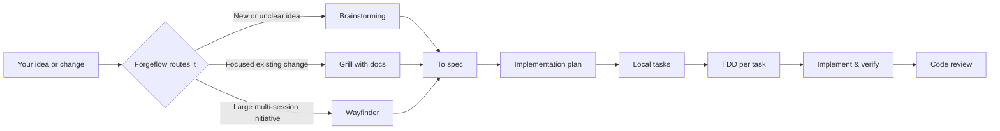

# Forgeflow

**Turn a rough idea into reviewed code—without letting the workflow run away from you.**

Forgeflow is a Codex plugin that bundles a practical, local-first product-and-engineering workflow. It helps you choose the right kind of thinking for the work in front of you, then guides the work from idea to tested implementation and review.

The important rule: **Forgeflow never moves to the next stage without your explicit approval.** It can recommend the next move; you remain the person pressing the button.

## What it helps with



At every handoff, Forgeflow shows what was decided, recommends the next skill, and waits for an approval such as:

```text
Approve next: to-spec
```

No silent transitions. No surprise “I’ve started rebuilding the app” moments.

## The workflow, in plain English

| Skill | Use it when | What you get |
| --- | --- | --- |
| `brainstorming` | You are starting with a new product or feature idea and need to shape it. | A clearer problem, users, constraints, and a direction worth building. |
| `grill-with-docs` | You have a focused change in an existing project and want the current docs/codebase to challenge the plan. | A reality-checked approach that fits the project you actually have. |
| `wayfinder` | The work is broad, long-running, or full of major choices. | A map of the initiative and the decisions that must be made first. |
| `to-spec` | The direction is agreed and you want a build-ready specification. | Clear requirements, boundaries, and acceptance criteria. |
| `implementation-plan` | The spec is approved and needs a technical delivery map. | Ordered steps, risks, boundaries, and verification strategy. |
| `to-tickets` | The plan is ready to split into manageable delivery work. | Small, ordered local task files with dependencies and done criteria. |
| `tdd` | A specific task is ready to build. | One behavior at a time: failing test, minimal code, passing test. |
| `implement` | A task has completed its TDD cycle. | Finished, verified code for that slice of work. |
| `code-review` | Implementation is finished and needs a careful second look. | Review findings and confidence before merging. |

## Local by default

Forgeflow keeps delivery artifacts beside the code, rather than requiring a ticketing system:

```text
docs/forgeflow/
├── briefs/     # A clear product direction from brainstorming
├── specs/      # Scope, success criteria, decisions, and test strategy
├── plans/      # Ordered technical implementation plan
├── tasks/      # One local task file per delivery slice
├── reviews/    # Review reports
└── state.md    # Where the workflow paused and what is next
```

GitHub Issues can still be used later as an export target, but they are never required.

## Model playbook

Forgeflow recommends, but does not automatically switch, models in Codex:

| Work | Recommended setting |
| --- | --- |
| Discovery, specs, and implementation plans | GPT-5.6 Sol · medium |
| Task formatting, state updates, and summaries | GPT-5.6 Luna · medium |
| TDD, implementation, and normal review | GPT-5.6 Terra · medium |
| Security, migrations, auth, payments, or deep architecture review | GPT-5.6 Sol · high |

## Install

```bash
git clone https://github.com/DaniManas/ForgeFlow.git
cd ForgeFlow
codex plugin marketplace add "$PWD"
codex plugin add forgeflow@forgeflow
```

Start a new Codex task, then invoke:

```text
/forgeflow
```

Describe what you want to build or change. Forgeflow will recommend the right entry point and wait for your approval before beginning.

## Update

From the cloned repository:

```bash
git pull
codex plugin add forgeflow@forgeflow
```

Then start a new Codex task so it loads the updated plugin instructions.

## Credits and licensing

Forgeflow is a bundle and orchestration layer. It does **not** claim authorship of the workflow skills it packages.

The following skills were created by [Matt Pocock](https://github.com/mattpocock) and come from [mattpocock/skills](https://github.com/mattpocock/skills):

- `grill-with-docs`
- `wayfinder`
- `to-spec`
- `to-tickets`
- `implement`
- `code-review`
- `tdd`

The bundled `brainstorming` skill comes from [obra/superpowers](https://github.com/obra/superpowers).

Forgeflow adds the routing and strict approval gates that connect these skills into one deliberate workflow. See [NOTICE.md](NOTICE.md) and [LICENSES](LICENSES/) for the included upstream notices and license texts.
