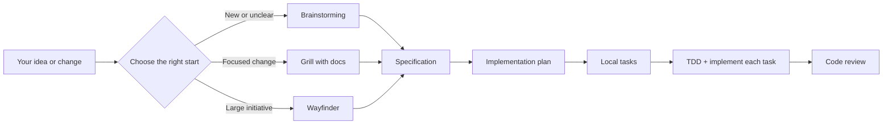

# Forgeflow

**A calm, approval-first path from “I have an idea” to reviewed code.**

Forgeflow is a Codex plugin for building a project or feature without losing the plot halfway through. It helps you decide what to build, captures the decision, breaks the work into safe pieces, tests and implements those pieces, then reviews the result.

The rule that matters most: **Forgeflow never starts the next step without your explicit approval.** It recommends what should happen next; you decide when it happens.

## Start here

1. Start a new Codex task.
2. Type `/forgeflow` and describe what you want to build or change.
3. Forgeflow recommends a starting skill and a mode.
4. If you agree, send the exact approval it gives you—for example:

   ```text
   Approve next: brainstorming
   ```

5. At the end of that step, read the result, ask for changes if needed, or approve the next named step.

That is the whole interaction model: **recommend → you approve → work happens → pause**.

## What Forgeflow chooses for you

You do not need to memorize the skills. Start with `/forgeflow`; it chooses one of these three entry points:

| If you say… | Forgeflow starts with | What happens there |
| --- | --- | --- |
| “I have a new app or feature idea.” | `brainstorming` | Shapes the problem, user, options, and best direction before anything is built. |
| “I need to add or change this specific thing.” | `grill-with-docs` | Challenges the change against the codebase and existing project docs so the plan fits reality. |
| “This is a big migration/roadmap with many unknowns.” | `wayfinder` | Maps the large initiative, its important decisions, and the sensible order to tackle it. |

If you already know which one you want, you can invoke that skill directly. Otherwise, `/forgeflow` is the easy door.

## The normal journey



Here is what each step gives you:

| Step | Skill | Output |
| --- | --- | --- |
| Understand the work | `brainstorming`, `grill-with-docs`, or `wayfinder` | A clear direction that suits the size of the work. |
| Agree on what “done” means | `to-spec` | A spec with scope, success criteria, decisions, and testable behavior. |
| Decide how to build it | `implementation-plan` | Ordered technical steps, risks, and a verification strategy. |
| Make it manageable | `to-tickets` | Small local task files with dependencies and acceptance criteria. |
| Build safely | `tdd` then `implement` | A focused test-first cycle, working code, and recorded checks for one task. |
| Check the full change | `code-review` | A review against both the project’s standards and the approved spec. |

For a very small change, Forgeflow may suggest skipping an unnecessary plan or task breakdown. It will explain why and still waits for your explicit approval of the next skill.

## Pick a pace

Forgeflow recommends a mode when it starts. You can change it before approving the first step.

| Mode | Choose it when | What you get |
| --- | --- | --- |
| **Fast** | The change is small, low-risk, and already clear. | Lean docs, sequential execution, valuable focused tests, and one focused review. Lowest typical token use. |
| **Balanced** *(default)* | You are building a normal feature or project. | The complete practical flow: spec, plan, tasks, TDD, implementation, and review. |
| **Thorough** | The work is ambiguous, expensive, security-sensitive, or architectural. | Deeper decisions and edge cases, TDD for every testable task, plus a risk-focused review. |

Parallel execution is never used in Fast mode. In Balanced or Thorough mode, Forgeflow offers it only when two or more tasks are truly independent and you explicitly approve the named batch. It can finish sooner, but it uses more total tokens.

## Where your work goes

Forgeflow is local-first. It does not require GitHub Issues or another project-management tool.

```text
docs/forgeflow/
├── briefs/     # Early product direction
├── specs/      # Scope and success criteria
├── plans/      # Technical delivery plan
├── tasks/      # Small delivery tasks
├── reviews/    # Final review reports
└── state.md    # The current stage and the next approval phrase
```

`state.md` is your bookmark: if you return later, it tells you what is finished and what needs approval next.

## Models Forgeflow recommends

Forgeflow never switches models by itself. It only suggests a good fit for the current stage:

| Work | Suggested model |
| --- | --- |
| Discovery, specs, and plans | GPT-5.6 Sol · medium |
| Task formatting, state updates, and summaries | GPT-5.6 Luna · medium |
| TDD, implementation, and ordinary review | GPT-5.6 Terra · medium |
| Security, auth, payments, migrations, sensitive data, or big architecture review | GPT-5.6 Sol · high |

## Install or update

Install from the public repository:

```bash
git clone https://github.com/DaniManas/ForgeFlow.git
cd ForgeFlow
codex plugin marketplace add "$PWD"
codex plugin add forgeflow@forgeflow
```

To update later:

```bash
git pull
codex plugin add forgeflow@forgeflow
```

After installing or updating, start a **new Codex task** so it loads the latest instructions.

## What Forgeflow adds

Forgeflow bundles established skills into one coherent workflow and adds the connective tissue:

- Smart routing between a new idea, a focused change, and a large initiative.
- Strict approval gates between every stage—no surprise execution.
- Local specs, plans, tasks, reviews, and workflow state instead of a required issue tracker.
- Three clear token/rigor modes: Fast, Balanced, and Thorough.
- Optional isolated subagents for genuinely independent tasks only.
- A model recommendation for each kind of work, without silently changing your model.

## Credits and licensing

Forgeflow is a bundle and orchestration layer; it does not claim authorship of the upstream skills.

These skills were created by [Matt Pocock](https://github.com/mattpocock) and are bundled from [mattpocock/skills](https://github.com/mattpocock/skills): `grill-with-docs`, `wayfinder`, `to-spec`, `to-tickets`, `implement`, `code-review`, and `tdd`.

The bundled `brainstorming` skill comes from [obra/superpowers](https://github.com/obra/superpowers). Forgeflow adds its routing, local-first artifacts, approval gates, modes, and optional parallel-execution workflow.

See [NOTICE.md](NOTICE.md) and [LICENSES](LICENSES/) for included notices and license texts.
