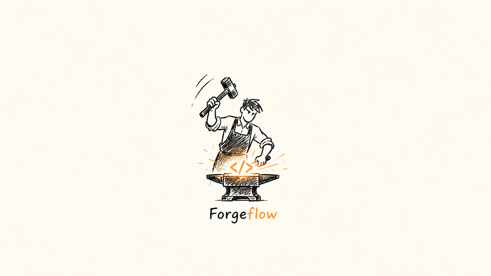
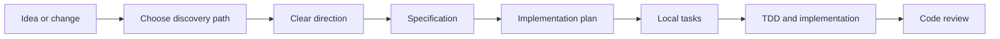

# Forgeflow

<p align="center">
  
</p>

**A calm, approval-first path from “I have an idea” to reviewed code.**

Forgeflow works with **any AI coding agent or capable chat model**. Codex has an optional plugin for a smoother experience, but it is not required.

The rule that matters: **Forgeflow never starts the next step without your explicit approval.** Your agent can recommend what is next; you decide when it happens.

## Choose your setup

| You use | Do this |
| --- | --- |
| Any coding agent or chat model | Give it [the portable Forgeflow core](core/FORGEFLOW.md). Add that file to the project instructions your tool reads, or paste its contents into a new conversation. |
| Codex | Install the optional Forgeflow plugin, then start with `/forgeflow`. The plugin provides skill discovery and the same approval-first workflow. |

For teammates, start with [Using Forgeflow without Codex](adapters/README.md). No OpenAI model is required.

## Start here

Tell your agent what you want to build or change, then say:

```text
Start Forgeflow in Balanced mode.
```

Your agent should recommend one starting path and stop for approval. If you agree, send its exact next-step approval—for example:

```text
Approve next: brainstorming
```

The rhythm is always: **recommend → you approve → work happens → pause**.

## What Forgeflow chooses for you

| If you say… | Forgeflow starts with | What happens there |
| --- | --- | --- |
| “I have a new app or feature idea.” | Brainstorming | Shapes the problem, users, options, and best direction before anything is built. |
| “I need to add or change this specific thing.” | Focused discovery | Challenges the change against the codebase and project docs so the plan fits reality. |
| “This is a big migration/roadmap with many unknowns.” | Wayfinding | Maps the large initiative, important decisions, and the sensible order to tackle it. |

## The normal journey



| Step | What you get |
| --- | --- |
| Understand the work | A clear direction that matches the size of the work. |
| Agree on what “done” means | A spec with scope, success criteria, decisions, and testable behavior. |
| Decide how to build it | Ordered technical steps, risks, and a verification strategy. |
| Make it manageable | Small local tasks with dependencies and acceptance criteria. |
| Build safely | A focused test-first cycle, working code, and recorded checks for each task. |
| Check the full change | A review against both project standards and the approved spec. |

For a very small change, Forgeflow may suggest skipping an unnecessary plan or task breakdown. It must explain why and still wait for your approval.

## Pick a pace

| Mode | Choose it when | What you get |
| --- | --- | --- |
| **Fast** | The change is small, low-risk, and already clear. | Lean docs, sequential execution, valuable focused tests, and one focused review. Lowest typical token use. |
| **Balanced** *(default)* | You are building a normal feature or project. | The complete practical flow: spec, plan, tasks, TDD, implementation, and review. |
| **Thorough** | The work is ambiguous, expensive, security-sensitive, or architectural. | Deeper decisions and edge cases, TDD for every testable task, plus a risk-focused review. |

Parallel execution is never used in Fast mode. In Balanced or Thorough mode, offer it only when two or more tasks are truly independent and the user explicitly approves the named batch.

## Model-neutral guidance

Choose models by role, not by brand:

| Work | Choose a model that is… |
| --- | --- |
| Discovery, specs, and plans | Strong at reasoning and trade-offs. |
| Task formatting and summaries | Fast and economical. |
| TDD and implementation | Strong at coding in the project’s language and framework. |
| Security, auth, payments, migrations, sensitive data, or deep architecture review | Your strongest available reasoning/coding model. |

Forgeflow never needs to switch a model on its own. It only makes a recommendation.

### Codex model suggestions

If you use Codex, Forgeflow additionally suggests GPT-5.6 Sol · medium for discovery/planning, Luna · medium for task formatting, Terra · medium for implementation/review, and Sol · high for risky review.

## Where work goes

Forgeflow is local-first. It does not require GitHub Issues or another tracker.

```text
docs/forgeflow/
├── briefs/     # Early product direction
├── specs/      # Scope and success criteria
├── plans/      # Technical delivery plan
├── tasks/      # Small delivery tasks
├── reviews/    # Final review reports
└── state.md    # What is complete and what needs approval next
```

`state.md` is your bookmark when you come back later.

## Use the optional Codex plugin

```bash
git clone https://github.com/DaniManas/ForgeFlow.git
cd ForgeFlow
codex plugin marketplace add "$PWD"
codex plugin add forgeflow@forgeflow
```

Then start a new Codex task and type `/forgeflow`.

## What Forgeflow adds

Forgeflow bundles established skills into one coherent workflow and adds:

- Smart routing between a new idea, a focused change, and a large initiative.
- Strict approval gates between every stage—no surprise execution.
- Local specs, plans, tasks, reviews, and workflow state instead of a required issue tracker.
- Fast, Balanced, and Thorough modes.
- Optional isolated subagents for genuinely independent tasks only.
- Model-neutral guidance, with optional Codex-specific recommendations.

## Credits and licensing

Forgeflow is a bundle and orchestration layer; it does not claim authorship of the upstream skills.

These skills were created by [Matt Pocock](https://github.com/mattpocock) and are bundled from [mattpocock/skills](https://github.com/mattpocock/skills): `grill-with-docs`, `wayfinder`, `to-spec`, `to-tickets`, `implement`, `code-review`, and `tdd`.

The bundled `brainstorming` skill comes from [obra/superpowers](https://github.com/obra/superpowers). Forgeflow adds its routing, local-first artifacts, approval gates, modes, and optional parallel-execution workflow.

See [NOTICE.md](NOTICE.md) and [LICENSES](LICENSES/) for included notices and license texts.
